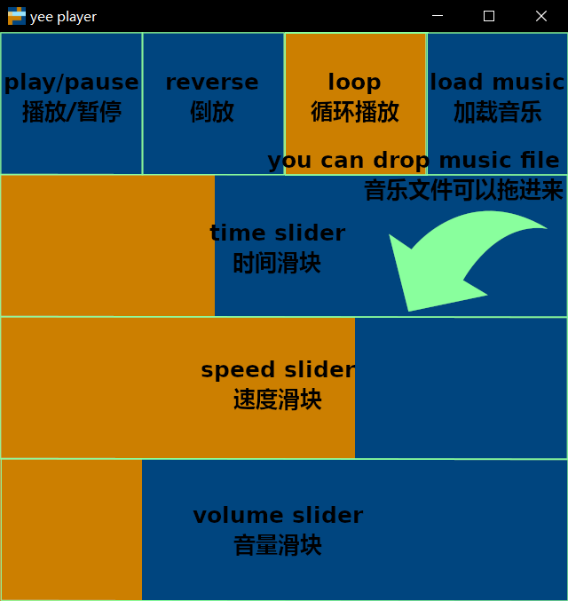

  

# Yee Player

simple music player written in Rust

使用Rust编写的简易音乐播放器

# Usage 使用方法

`play/pause button` and `reverse button` will changed the playback speed to acheive their function

`播放/暂停按钮` 和 `倒放按钮` 通过改变播放速度来实现其功能

`load music button` will read [`asset/setting/music_path.txt`](asset/setting/music_path.txt) to locate the music file

`加载音乐按钮`会读取[`asset/setting/music_path.txt`](asset/setting/music_path.txt)文件中指定的路径来寻找要加载的音乐文件

this program will load the whole audio data into memory, loading long audio file may crash

本程序将加载整个音频数据到内存中，加载过长的音频文件可能会导致崩溃

# Setting 设置

you can change some setting by editing `asset/setting/setting.ron`

你可以在`asset/setting/setting.ron`文件中修改程序的一些设置

feilds of [`setting.ron`](asset/setting/setting.ron):

[`setting.ron`](asset/setting/setting.ron)中的参数：

    // width of the window  窗口的宽度
    window_width: f32
    // height of the window  窗口的高度
    window_height: f32
    // max playback speed when moving the speed slider  移动速度滑块时可以调节的最大播放速度
    max_play_speed: f32
    // min playback speed when moving the speed slider  移动速度滑块时可以调节的最低播放速度
    min_play_speed: f32

# Main Dependencies 主要依赖库

this project mainly uses the following crates

本工程主要使用了以下库

* [`winit`](https://crates.io/crates/winit): input handling and window creating  处理用户输入以及创建窗口

* [`wgpu`](https://crates.io/crates/wgpu): graphics rendering  图像渲染

* [`legion`](https://crates.io/crates/legion): logic construction  逻辑处理

* [`rodio`](https://crates.io/crates/rodio): audio decoding and playing  音频解码与播放
